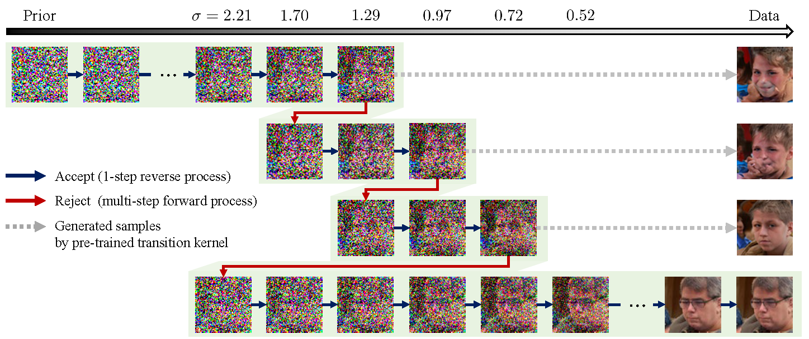
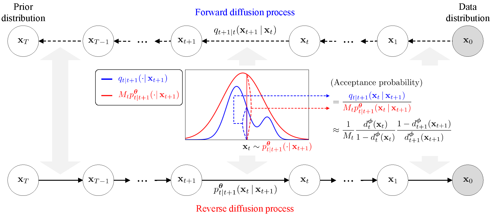

# Diffusion Rejection Sampling (DiffRS) (ICML 2024)
This repository is the implementation of Diffusion Rejection Sampling, for Gaudi-v2 of the code below :
* [Na, B., Kim, Y., Park, M., Shin, D., Kang, W., & Moon, I. C. Diffusion Rejection Sampling. In Forty-first International Conference on Machine Learning.](https://github.com/aailabkaist/DiffRS)

| [paper](https://proceedings.mlr.press/v235/na24a.html) | [arXiv](https://arxiv.org/abs/2405.17880) | [poster](https://icml.cc/media/PosterPDFs/ICML%202024/34559.png?t=1721399675.3276865) |

**[Byeonghu Na](https://sites.google.com/view/byeonghu-na), [Yeongmin Kim](https://sites.google.com/view/yeongmin-space), Minsang Park, Donghyeok Shin, [Wanmo Kang](https://sites.google.com/site/wanmokang), and [Il-Chul Moon](https://aai.kaist.ac.kr/bbs/board.php?bo_table=sub2_1&wr_id=3)**   

--------------------

This paper introduces **Diffusion Rejection Sampling (DiffRS)**, a new diffusion sampling approach that ensures alignment between the reverse transition and the true transition at each timestep.

